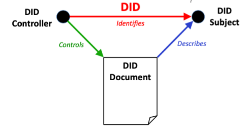

# Decentralized Identifiers

## Authors
- Daniel Burnett
- Brent Zundel

## Participate
- [Issue tracker](https://github.com/w3c/did-core/issues)
- [Mailing List](public-did-wg@w3.org)
- [Archives](https://lists.w3.org/Archives/Public/public-did-wg/)

## Table of Contents
- [Decentralized Identifiers](#decentralized-identifiers)
  - [Authors](#authors)
  - [Participate](#participate)
  - [Table of Contents](#table-of-contents)
  - [Introduction](#introduction)
  - [Goals](#goals)
  - [Non-Goals](#non-goals)
  - [Key scenarios](#key-scenarios)
  - [Detailed design discussion](#detailed-design-discussion)
    - [Identifiers, not Identity](#identifiers-not-identity)
    - [DID Methods](#did-methods)
    - [Assertion of Control of a DID](#assertion-of-control-of-a-did)
    - [DID Documents](#did-documents)
    - [DID Resolution](#did-resolution)
    - [DID Dereferencing](#did-dereferencing)
  - [Considered alternatives](#considered-alternatives)
    - [Proprietary account names](#proprietary-account-names)
    - [Open ID / OIDC](#open-id--oidc)
    - [Other URI Schemes](#other-uri-schemes)
  - [Stakeholder Support or Opposition](#stakeholder-support-or-opposition)
  - [References and acknowledgements](#references-and-acknowledgements)

## Introduction
A decentralized identifier, or DID, is a new URI scheme. Unlike existing HTTP
URLs, email addresses, commercial account identifiers, most government
identifiers, etc., the DID is purpose-designed to support
cryptographically-controlled identifiers backed by decentralized oracles (such
as a distributed ledger).

Syntactically, a DID looks like this:  `did:btcr:xyv2-xzpq-q9wa-p7t`. 

The three parts of a DID, separated by colons, are:
* The string “did”, representing the `did` URI scheme.
* A *DID Method*, in this case `btcr`, that must be one of the values in the
  [DID Method Registry](https://www.w3.org/TR/did-spec-registries/#did-methods)
* A string that is interpreted according to the rules of the specific DID
  method, in this case `xyv2-xzpq-q9wa-p7t`.

## Goals
* Key management flexibility
    * Indirection
    * Auditability
    * Management without dependence on external authority
* More flexibility for credential issuance and usage
* More flexibility for cryptographically anchored transactions
    * Signatures
    * Cryptocurrency
    * Authentication
* Key discovery
* Permanent identifiers, that can be used for various use cases:
    * Issue of long term documents
    * Unique representation of artifacts
* Transient identifiers, that can be created and destroyed at ease
    * Low cost
    * Minimal or zero administrator 
* Service discovery
* Provide a purpose-built solution
    * Existing protocols may offer some of these features, but they are either
      incomplete or are not purpose-built with our features in mind.

## Non-Goals
- Creating decentralized identities
- Creating a URI scheme that is expected to be implemented by web browsers,
  although it may be
- Initiating, facilitating, or aiding a complete disruption of existing systems
  - On the contrary, a pragmatic, incremental specification process can minimize
    disruptions in an incremental transition
- Replacing DNS
- Guaranteeing high-level or general-purpose identity assurance
- Content-addressed data stores
  - For that, you might want to look into IPFS, DataShards, the Textile project,
    or IPLD
- Human-readable identifiers
- Defining or specificing DID-based authentication or authorization mechanisms
  - We do everything possible to support those efforts and align on primitives,
    but those topics are out of scope here
- Identifiers for bearing or binding to Personally Identifiable Information (PII)
  - We do everything possible to make DIDs useful identifiers for sophisticated
    PII-handling systems, but any binding of PII to discoverable identifiers
    carries some form of risk
- Other non-goals are these from the essay "7 Myths of SSI" by Timothy Ruff
  ([part 1](https://medium.com/evernym/7-myths-of-self-sovereign-identity-67aea7416b1)
  and [part 2](https://medium.com/evernym/7-myths-of-self-sovereign-identity-b16648c3090d))
  - Self-sovereign means self-attested.
  - SSI attempts to reduce government’s power over an identity owner.
  - SSI creates a national or “universal ID” credential.
  - SSI gives absolute control over identity.
  - There’s a “main” issuer of credentials.
  - There’s a built-in method of authenticating.
  - User-centric identity is the same as SSI.

## Key scenarios
For key scenarios, please see
[Use Cases and Requirements for Decentralized Identifiers](https://w3c.github.io/did-use-cases/)

We specifically encourage reviewing the
[set of focal use cases](https://w3c.github.io/did-use-cases/#focalUseCases)
from that document.

## Detailed design discussion

### Identifiers, not Identity
It is important to note that a DID is a *decentralized **identifier***, and not
a *decentralized **identity***. While a DID could be used as an identifier in an
identity system, the standard itself is expected to only define the identifier
itself, making no claims about interpretability as an identity.

Although the standard will not expressly enforce privacy, it is a strong goal of
the work, that DIDs, and specific *DID Methods*, can be used in ways that
strongly reduce correlatability of personally-identifiable information.

### DID Methods
A key component of the decentralized identifier specification is the notion of
[DID Methods](https://w3c.github.io/did-core/#methods). *DID Methods* are a
means by which DIDs are "decentralized", as any number of *DID Methods* may be
created, each with different properties and assurances. The DID specification
defines what a conforming *DID Method* specification must contain. A *DID
Method* specification describes a particular type of DID and defines how it may
be created, updated, resolved, or deactivated. It also must provide security and
privacy considerations for that *DID Method*.

### Assertion of Control of a DID
A key property of a DID is that it has a controller. Commonly, this entity will
use public-key cryptography to assert control of a DID. This assertion of
control may be used as an authentication mechanism. The standard does not define
new authentication mechanisms, but does reference existing ones.

### DID Documents
For some DID methods the URI string itself is sufficient to understand how to
verify control over the DID, including key rotation and revocation. An example
is [the `did:key` method](https://w3c-ccg.github.io/did-method-key/), which
interprets the third part of the DID as a public key. To support other, more
complex, DID interactions, the concept of a *DID document* is introduced. This
document typically provides other details regarding how to assert control over
the DID or connect with the DID subject. The *DID Document* may contain one or
more links to external resources. One example of these is
[service endpoints](https://w3c.github.io/did-core/#service-endpoints). The DID
Document for a DID may change over time, but at any moment, there is only one
DID Document for a DID. A DID method defines how a DID resolves to a DID
document for that method.
[Here is an example DID document.](https://w3c.github.io/did-core/#example-2-minimal-self-managed-did-document)

### DID Resolution
Just as with HTTP URIs, DIDs are expected to be resolved and dereferenced. As
per [RFC 3986](https://tools.ietf.org/html/rfc3986), *resolution* is the process
of determining the operations that can be performed on/with the resource
identified by the DID, along with any
[access control or authorization](#Assertion-of-Control-of-a-DID). Resolution
results in a [DID Document](#DID-Documents) and possibly some metadata about the
resolution process. Though the resolution process itself is out of scope for
this version of the DID specification, the specification does define abstract
function signatures that a conforming DID resolver must implement against. For
more detail, [please refer to the specification.](https://w3c.github.io/did-core/#did-resolution)  

### DID Dereferencing
*Dereferencing* is the process of performing the operations identified during
resolution. Supported operations are defined by *DID Methods* and may include:
- *create*
- *read*
- *update*
- *deactivate*

## Considered alternatives
The alternatives that prompted the creation of DIDs were considered well before
the initiation of the Working Group to develop this specification from the
preliminary work done by the Credentials Community Group. Listed here are some
of the other identifier approaches whose characteristics motivated the creation
of DIDs.

### Proprietary account names
A common identifier nowadays is a username or email address. These identifiers
tend to be issued by entities that can, administratively, change or remove them
without the permission or even knowledge of the identifier holder. DIDs were
explicitly created to allow for an identifier that could not be modified or
taken away from a controller by any third party.

### Open ID / OIDC
One possible use for DIDs is as an
[authentication mechanism](https://www.w3.org/TR/did-use-cases/#authenticate).
While at first glance it may appear that DIDs compete with existing
authentication mechanisms such as OIDC or WebAuthn, they are actually
complementary to such technologies and with some effort
[may even be incorporated with them](https://medium.com/decentralized-identity/using-openid-connect-with-decentralized-identifiers-24733f6fa636).

### Other URI Schemes
DIDs are a new type of identifier that has some essential characteristics:
- *decentralized*: there should be no central issuing agency;
- *persistent*: the identifier should be inherently persistent, not requiring
  the continued operation of an underlying organization;
- *cryptographically verifiable*: it should be possible to prove control of the
  identifier cryptographically;
- *resolvable*: it should be possible to discover metadata about the identifier.
- *replaceable*: it should be simple to discard old and create new identifiers.

Although existing identifiers may display some of these characteristics, none
currently displays all of them.

## Stakeholder Support or Opposition
There is broad interest in and support for DIDs across the digit laidentity
community. Early in the Working Group's history there was a concern around *DID
Documents* only having a JSON-LD-based format defined. Since then the
specification has added both JSON-only and CBOR formats.

The number of entries already in the
[DID Method Registry](https://w3c.github.io/did-spec-registries/#did-methods) is
evidence of the interest in this work.

## References and acknowledgements
Many thanks for valuable feedback and advice from Juan Caballero and
participants (listed alphabetically) in:

- Decentralized Identify Foundation (DIF)
- Internet Identity Workshop
- Rebooting the Web of Trust
- W3C Credentials Community Group
- W3C Decentralized Identifier Working Group
